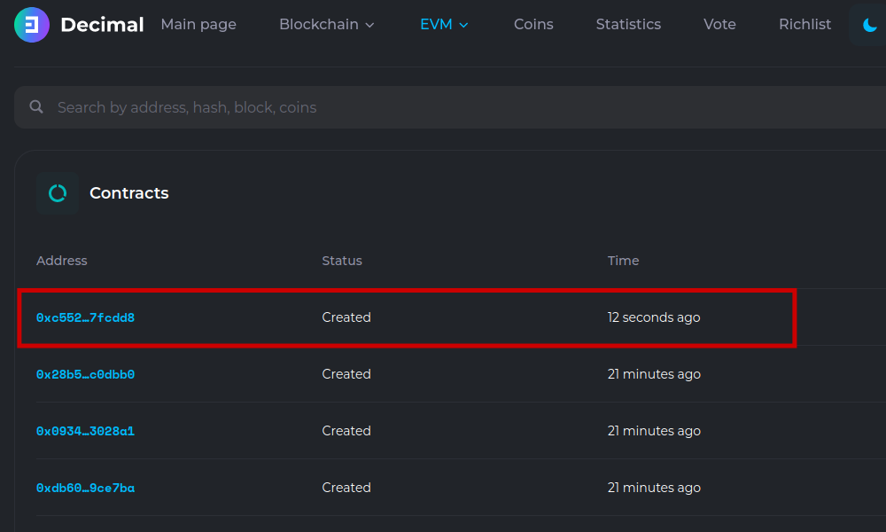
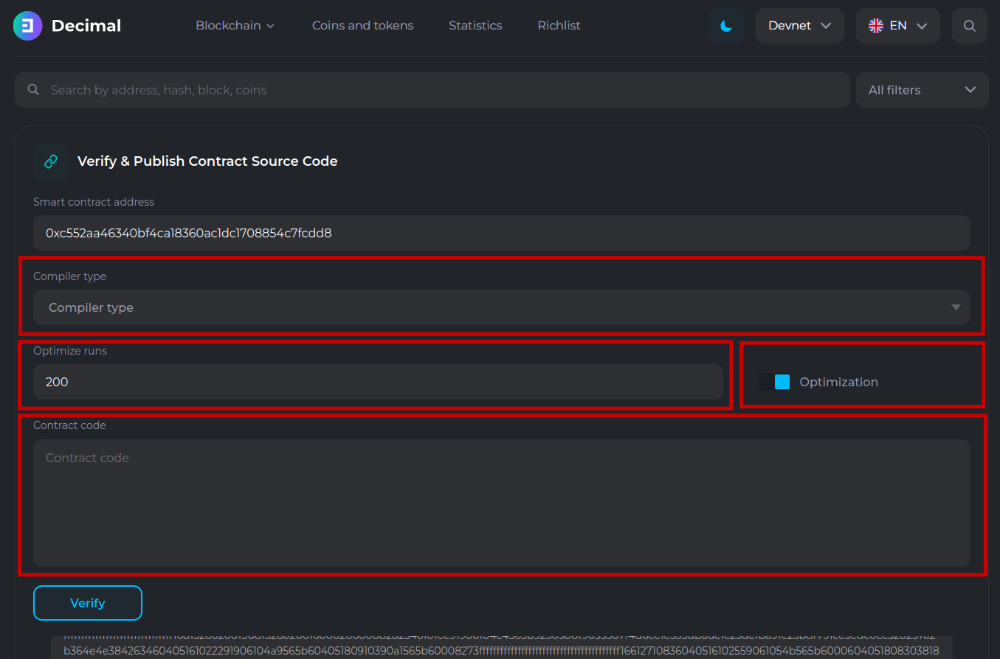
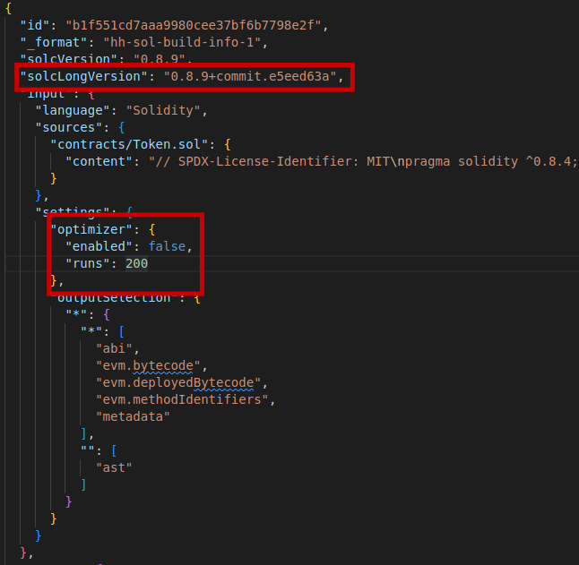
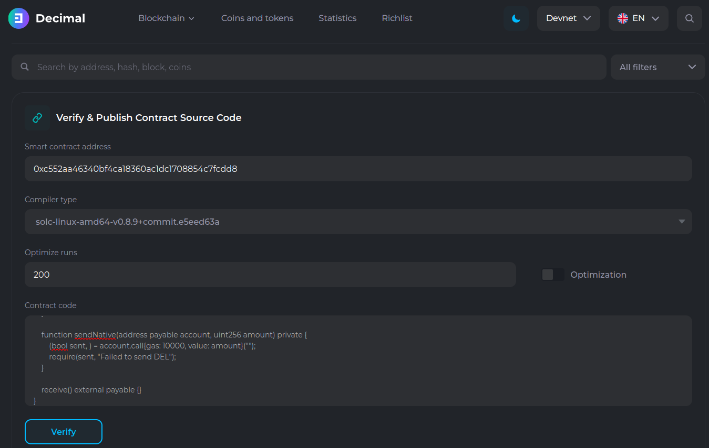

# 2. Decimal verification tutorial 

This Tutorial has the goal to quickly teach you, how to verify deployed smart contract in decimal smart chain.

**In this tutorial we will use contract written in previous lesson.** 
### How to verify smart contracts in Decimal smart chain
#### 2.1 Open decimal block explorer by link:
``https://devnet-dec2.explorer.decimalchain.com/contracts``

#### 2.2 Find your contract there, using address gotten in previous tutorial

#### 2.4 Click on ``Check and publish``

#### 2.5 Here you see verification tab, you can choose compiler version, amount of optimization runs and put code of your contract.

### How to find your compiler options:
#### 2.5.1 Open the root of your project
#### 2.5.2 Open ``artifacts/contracts/<contract name>.sol/<contract name>.dbg.json``
#### 2.5.3 Here you can find path to your build-info

###### 2.5.4 Go through the path and open the build-info file 

###### 2.5.5 Go through the path and open the build-info file 
``solcLongVersion for us is 0.8.9+commit.e5eed63a``
``Optimizer turned off and have 200 runs``

#### 2.6 Put this parameters and your flattened contract code to verification tab like this:

#### 2.7 If everything went well, you should see the verified status:

