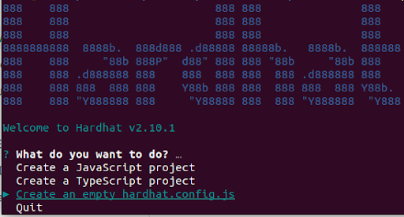

# 1. Decimal deploy tutorial for beginners

Welcome to our beginners guide to Decimal smart chain contracts and dApp development. This Tutorial has the goal to quickly teach you how to write and deploy smart contract to decimal smart chain.

**In this tutorial we will use:**

- Solidity
- JavaScript
- Node.js
- Ethers.js
- Hardhat

## Setting up environment

In a first step we need to install Node.js.

### Installing Node.js

You can skip this section if you already have a working `Node.js >= 16.0 `

#### Paste this commands in a terminal:

```jsx title="Ubuntu"
sudo apt update
sudo apt install curl git
curl -fsSL https://deb.nodesource.com/setup_18.x | sudo -E bash -
sudo apt-get install -y nodejs
```

```jsx title="MacOS"
curl -o- https://raw.githubusercontent.com/nvm-sh/nvm/v0.39.1/install.sh | bash
nvm install 18
nvm use 18
nvm alias default 18
npm install npm --global # Upgrade npm to the latest version
```

```jsx title="Windows"
To install Node.js on windows follow this guide:
https://docs.microsoft.com/en-us/windows/dev-environment/javascript/nodejs-on-windows
```

## Creating a new hardhat project

Open a new terminal and run this commands to create a new folder

```jsx title="Creating a new folder"
mkdir hardhat-tutorial
cd hardhat-tutorial
```

```jsx title="Install hardhat and run it:"
npm install –save-dev hardhat
npm install –save-dev @nomicfoundation/hardhat-toolbox
npx hardhat
```

Select `Create an empty hardhat.config.js` with your keyboard and hit enter.
Hardhat.config.js is usually located in the project root folder and contains the entirety of your setup.



## Writing smart contract

Let's start by creating a new folder in our hardhat project named `contracts`. In this folder we create file named `token.sol`.

#### Put this code into the file:

```jsx title="contracts/token.sol"
// SPDX-License-Identifier: MIT
pragma solidity ^0.8.4;

contract ExampleContract {
   mapping(address => uint256) balances;

   event Deposit(uint256 value);
   event Withdraw(address indexed receiver, uint256 value);

   constructor() {}

   function deposit() external payable {
       balances[msg.sender] += msg.value;
       emit Deposit(msg.value);
   }

   function withdrawNative(address payable receiver, uint256 amount) public {
       require(amount >= balances[msg.sender], "Insufficient balance");
       balances[msg.sender] -= amount;

       sendNative(receiver, amount);

       emit Withdraw(receiver, amount);
   }

   function sendNative(address payable account, uint256 amount) private {
       (bool sent, ) = account.call{gas: 10000, value: amount}("");
       require(sent, "Failed to send DEL");
   }

   receive() external payable {}
}
```

To compile the contract run `npx hardhat compile` in your terminal.

```jsx title="Contract compilation"
npx hardhat compile
Compiled 1 Solidity file successfully
```

## Deploying to the Decimal smart chain

So you are ready to test your contract on a real network, this way others get access to your code and can check it.

In real Decimal smart chain “mainnet” you must pay for transaction in real money, but there is a separate “devnet” network, which mimics real world scenarios without putting real money at stake.

At the software level, deploying to the devnet is the same as deploying to the mainnet. The only difference is which network you connect to. Let's look into what the code to deploy your contracts using ethers.js would look like.

Lets create a new folder inside the root of the project named `scripts` and create file named `deploy.js` there.

#### Put this code into the file:

```jsx title="scripts/deploy.js"
async function main() {
  const accounts = await ethers.getSigners();
  console.log("Deploying contract with account:", accounts[0].address);

  const balance = await accounts[0].getBalance();
  console.log("Account balance ", balance.toString());

  // Gas price should be a little bit more than ethers.provider.getGasPrice() is returning
  // If you catch ProviderError, try to increase gasPrice
  const gasPrice = ethers.utils.parseUnits("70000", "gwei");

  const ExampleContract = await ethers.getContractFactory("ExampleContract");

  const exampleContract = await ExampleContract.connect(accounts[0]).deploy({
    gasPrice: gasPrice,
  });
  await exampleContract.deployed();

  console.log("ExampleContract address:", exampleContract.address);
}

main()
  .then(() => process.exit(0))
  .catch((error) => {
    console.error(error);
    process.exit(1);
  });
```

To tell Hardhat which network do you want connect to, you use the `--network` parameter when running any task, like this:

```jsx title="Network connection"
npx hardhat run scripts/deploy.js –network <network-name>
```

With our configuration, running it without `–network` parameter will deploy contract in the local `Hardhat Network`. The deployment gets lost after execution, but it is still useful for testing our deployment code.

```jsx title="Deploy in the local hardhat network"
npx hardhat run scripts/deploy.js –network <network-name>
```

To deploy in a remote network such as `mainnet` or `devnet`, you need to configure network entry in your `hardhat.config.js` file. We will use `devnet` for this example.

#### Put this code into `hardhat.config.js`.

```jsx title="hardhat.config.js"
require("@nomicfoundation/hardhat-toolbox");

const MNEMONIC = "YOUR MNEMONIC";

module.exports = {
  solidity: "0.8.9",
  networks: {
    decimal_devnet: {
      url: "https://devnet-val.decimalchain.com/web3/",
      chainId: 20202020,
      accounts: { mnemonic: MNEMONIC },
    },
  },
};
```

To deploy on Decimal `devnet` you need to send some `devnet DEL` to the address that's going to be making the deployment. You can get `devnet DEL` from a faucet, a service that distributes `devnet DEL` for free.

Finally, run:

```jsx title="Deploy to live network"
npx hardhat run scripts/deploy.js --network decimal_devnet
```

If everything went well, you should see the deployed contract address.
